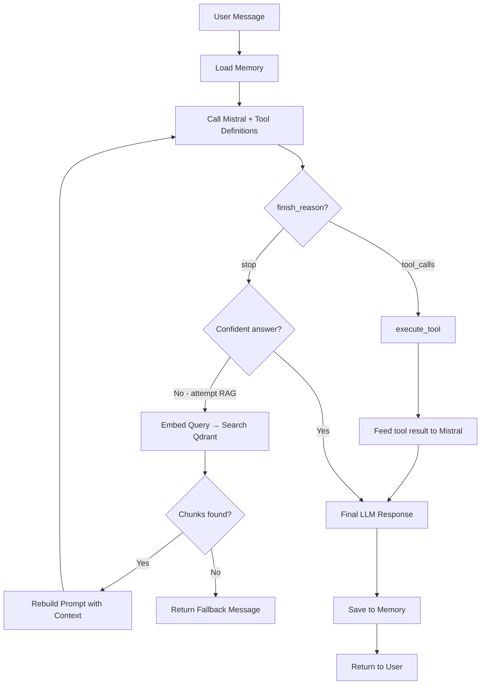

# 🤖 Smart AI Agent — Production Roadmap & Architecture
### Studio Butterfly Take-Home Assignment
**Stack: Mistral AI · Qdrant · FastAPI · Python (uv)**

---

## 🏗️ Technology Decisions (Senior Dev Reasoning)

| Layer | Choice | Why |
|---|---|---|
| **LLM** | Mistral AI (`mistral-large-latest`) | Free tier, native function-calling, fast inference |
| **Embeddings** | `mistral-embed` | Stays in same API, no extra key needed |
| **Vector DB** | **Qdrant** (local Docker / in-memory) | Production-grade, free, better than FAISS for filtering; easier than ChromaDB for tool-augmented search |
| **Framework** | FastAPI | Client requirement, async-native |
| **Memory** | In-process `deque` + Redis-optional | Simple session buffer, no extra infra needed for MVP |
| **Package Manager** | `uv` | 10-100x faster than pip |
| **Document Loader** | `pymupdf` + `python-markdown` | Best PDF parser; lightweight MD support |
| **Text Splitting** | `langchain-text-splitters` (RecursiveCharacterTextSplitter) | Battle-tested, no full LangChain required |
| **Orchestration** | Custom Router (no LangChain Agent) | Gives you full control, easier to explain/document |

---

## 🛠️ Suggested Tools (Mock Tool Calling)

These are the 2 required + 1 bonus tool you should implement:

| Tool Name | Trigger Phrase Examples | Data Source | What it Returns |
|---|---|---|---|
| `get_order_status` | "where is my order", "track order ORD001" | `data/orders.json` | status, estimated delivery |
| `search_product` | "do you have", "price of", "is X in stock" | `data/products.json` | name, price, availability |
| `get_weather` *(bonus)* | "what's the weather" | Hardcoded mock response | city, temperature, condition |

> Adding a 3rd tool (even if fake) **shows the evaluator your router is generalizable**, not hardcoded for 2 tools.

---

## 📁 Production Folder Structure 

```
smart-ai-agent/
│
├── .env.example                    # Template for all env vars (no secrets)
├── .gitignore
├── README.md                       # Full setup + architecture doc
├── pyproject.toml                  # uv project config
├── requirements.txt                # Generated by uv (pip-compatible)
│
├── docs/
│   └── architecture.md             # Pipeline diagram (Mermaid) + decisions
│
├── data/
│   ├── orders.json                 # Mock order data
│   ├── products.json               # Mock product data
│   └── sample_docs/
│       └── studio_butterfly.pdf    # Sample uploadable document
│
├── app/
│   ├── __init__.py
│   ├── main.py                     # FastAPI app entry point
│   ├── config.py                   # Settings (Pydantic BaseSettings)
│   │
│   ├── api/
│   │   ├── __init__.py
│   │   ├── routes/
│   │   │   ├── __init__.py
│   │   │   ├── chat.py             # POST /chat
│   │   │   ├── ingest.py           # POST /ingest (file upload)
│   │   │   └── health.py           # GET /health
│   │   └── dependencies.py         # FastAPI Depends() providers
│   │
│   ├── agent/
│   │   ├── __init__.py
│   │   ├── router.py               # ⭐ The Brain — decides RAG / Tool / Direct
│   │   ├── memory.py               # Session-based conversation memory
│   │   └── prompts.py              # All system + tool prompts (centralized)
│   │
│   ├── rag/
│   │   ├── __init__.py
│   │   ├── ingestion.py            # Load → Chunk → Embed → Store
│   │   ├── retriever.py            # Query Qdrant → return top-k chunks
│   │   └── embeddings.py           # Mistral embedding wrapper
│   │
│   ├── tools/
│   │   ├── __init__.py
│   │   ├── registry.py             # Tool registration & dispatch
│   │   ├── order_status.py         # Tool 1: get_order_status()
│   │   ├── product_search.py       # Tool 2: search_product()
│   │   └── weather.py              # Tool 3 (bonus): get_weather()
│   │
│   ├── vector_store/
│   │   ├── __init__.py
│   │   └── qdrant_client.py        # Qdrant connection + CRUD helpers
│   │
│   └── models/
│       ├── __init__.py
│       ├── chat.py                 # Pydantic: ChatRequest, ChatResponse
│       └── ingest.py               # Pydantic: IngestResponse
│
└── tests/
    ├── __init__.py
    ├── test_router.py              # Unit test: routing decisions
    ├── test_tools.py               # Unit test: tool outputs
    ├── test_rag.py                 # Unit test: retrieval quality
    └── test_api.py                 # Integration: FastAPI endpoints
```

---

## 🗺️ Step-by-Step Implementation Roadmap

> **Do these phases in order. Each phase must be working before moving to next.**

---

### ✅ PHASE 0 — Project Bootstrap (Day 1, ~1 hour) (done)

**Goal:** Get a running skeleton with no actual logic.

1. Install `uv` globally if not installed
2. Create a new project with `uv init smart-ai-agent`
3. Set the Python version with `uv python pin 3.11`
4. Create the full folder structure (all empty `__init__.py` files)
5. Create `.env.example` with variables: `MISTRAL_API_KEY`, `QDRANT_HOST`, `QDRANT_PORT`, `QDRANT_COLLECTION_NAME`
6. Copy `.env.example` → `.env`, fill in your Mistral API key
7. Create `requirements.txt` with all dependencies (see Phase 1 for list)
8. Run `uv pip install -r requirements.txt` to verify everything installs
9. Write a minimal `app/main.py` that starts FastAPI and returns `{"status": "ok"}` on `GET /health`
10. Confirm the server starts: `uv run uvicorn app.main:app --reload`

**Exit Criteria:** Server starts, `/health` returns 200.

---

### ✅ PHASE 1 — Dependencies & Configuration (Day 1, ~30 min) (done)

**Goal:** Lock down all packages and config.

**`requirements.txt` packages to include:**

```
# Core framework
fastapi
uvicorn[standard]
python-multipart          # For file uploads

# LLM & Embeddings
mistralai                 # Official Mistral Python SDK

# Vector Database
qdrant-client             # Qdrant Python client

# Document Processing
pymupdf                   # PDF parsing (fitz)
markdown                  # Markdown to text
langchain-text-splitters  # Chunking only (no full langchain)

# Data & Validation
pydantic
pydantic-settings         # For config.py BaseSettings

# Utilities
python-dotenv
httpx                     # Async HTTP client
aiofiles                  # Async file I/O

# Testing
pytest
pytest-asyncio
httpx                     # Also used for TestClient
```

1. Write `app/config.py` using `pydantic-settings` `BaseSettings` to load from `.env`
2. Validate all env vars are present on startup — crash early if missing
3. Write `app/api/dependencies.py` that provides singleton instances (Qdrant client, Mistral client) via `Depends()`

**Exit Criteria:** `from app.config import settings` works, all keys load correctly.

---

### ✅ PHASE 2 — Vector Store Setup (Day 1, ~1 hour) (done)

**Goal:** Qdrant running and writable.

**Decision:** Run Qdrant locally using in-memory mode (no Docker needed for MVP). Switch to Docker for production.

1. Write `app/vector_store/qdrant_client.py`:
   - Initialize `QdrantClient` in in-memory mode (`":memory:"`) OR local path (`"./qdrant_data"`)
   - Write `create_collection()` function — call on app startup
   - Write `upsert_vectors(vectors, payloads)` helper
   - Write `search_vectors(query_vector, top_k)` helper
2. In `app/main.py` `startup` event — call `create_collection()` so it's ready before any request hits

**Why local path over in-memory:** Survives server restarts, no data loss during dev.

**Exit Criteria:** Collection creation runs without error on startup.

---

### ✅ PHASE 3 — RAG Ingestion Pipeline (Day 2, ~2 hours) (done)

**Goal:** Upload file → chunks stored in Qdrant.

1. Write `app/rag/embeddings.py`:
   - Wraps Mistral's `mistral-embed` model
   - Accepts a list of text strings
   - Returns a list of 1024-dim float vectors
   - Batch properly (Mistral embed max: 512 tokens per chunk recommended)

2. Write `app/rag/ingestion.py`:
   - `load_document(file_path, file_type)` → raw text string
     - PDF: use `pymupdf` (`fitz.open()`)
     - TXT: plain `open().read()`
     - MD: use `markdown` to strip to plain text
   - `chunk_text(text)` → list of string chunks
     - Use `RecursiveCharacterTextSplitter` with `chunk_size=512`, `chunk_overlap=64`
     - **Document your chunk size decision in README** (evaluators look for this)
   - `ingest_document(file_path, file_type)` → calls load → chunk → embed → upsert
     - Each chunk stored with metadata: `{source_file, chunk_index, text}`

3. Write `app/api/routes/ingest.py`:
   - `POST /ingest` — accepts `multipart/form-data` file upload
   - Saves file temporarily to `/tmp/`
   - Calls `ingest_document()`
   - Returns `{chunks_stored: N, status: "success"}`

**Exit Criteria:** Upload a PDF → check Qdrant has N vectors stored.

---

### ✅ PHASE 4 — RAG Retrieval (Day 2, ~1 hour) (done)

**Goal:** Query → get relevant chunks back.

1. Write `app/rag/retriever.py`:
   - `retrieve(query_text, top_k=3)` function
   - Embeds the query using `embeddings.py`
   - Calls `qdrant_client.search_vectors(query_vector, top_k)`
   - Returns list of `{text, score, source_file}` dicts
   - If best score < `0.65` threshold → return empty list (no relevant context found)
   - **Document your score threshold decision in README**

**Exit Criteria:** Query a question about the uploaded doc → get relevant chunks.

---

### ✅ PHASE 5 — Memory System (Day 2, ~45 min) (done)

**Goal:** Conversation context persists within a session.

1. Write `app/agent/memory.py`:
   - `ConversationMemory` class backed by a `collections.deque(maxlen=10)` (last 10 turns)
   - Methods: `add_turn(role, content)`, `get_history()` → list of `{role, content}` dicts
   - `clear()` method
   - A `MemoryStore` dict-based registry: `{session_id: ConversationMemory}`
   - `get_or_create_session(session_id)` → returns the right memory object
2. Memory must be passed to the LLM as `messages` array in every call
3. Keep it **in-process for now** (no Redis) — document this limitation in README

**Exit Criteria:** Two-turn conversation: "My name is John" → "What's my name?" → correct answer.

---

### ✅ PHASE 6 — Mock Tools (Day 3, ~1.5 hours) 

**Goal:** Tools that look up JSON data and return structured results.

1. Create `data/orders.json` with 5-10 sample orders:
   ```json
   [{"order_id": "ORD001", "status": "Shipped", "estimated_delivery": "2026-07-05"}]
   ```
2. Create `data/products.json` with 10-15 sample products:
   ```json
   [{"name": "Wireless Mouse", "price": 29.99, "in_stock": true}]
   ```
3. Write `app/tools/order_status.py` → `get_order_status(order_id: str) -> dict`
4. Write `app/tools/product_search.py` → `search_product(product_name: str) -> dict`
5. Write `app/tools/weather.py` → `get_weather(city: str) -> dict` (fully hardcoded)
6. Write `app/tools/registry.py`:
   - `TOOL_DEFINITIONS` list — Mistral-compatible JSON schema for each tool
   - `execute_tool(tool_name, tool_args)` dispatcher function
   - This is the **only place** tool execution happens

**Why a registry:** Clean separation. Adding a new tool = one file + one entry in registry.

**Exit Criteria:** `execute_tool("get_order_status", {"order_id": "ORD001"})` returns correct data.

---

### ✅ PHASE 7 — The Agent Router (Day 3, ~2 hours — MOST IMPORTANT)

**Goal:** The brain that decides what to do with each message.

1. Write `app/agent/prompts.py`:
   - `SYSTEM_PROMPT` — tells Mistral it is an AI assistant for Studio Butterfly
   - Includes instructions: when to use tools, when to say fallback message
   - Include the exact fallback string: `"I couldn't find that information in the uploaded documents."`
   - Keep it as a constant — easier to document decisions

2. Write `app/agent/router.py` — the `AgentRouter` class:

   **The routing algorithm (explain every step in README):**

   ```
   Step 1: Load conversation history from memory
   Step 2: Call Mistral with tool_definitions attached
   Step 3: Check the response finish_reason:
       - "tool_calls"  → extract tool name + args → execute_tool() → feed result back → get final response
       - "stop"        → check if response is useful
           - If response text contains fallback keywords → attempt RAG retrieval
               - If RAG returns chunks → rebuild prompt with context → re-call Mistral
               - If RAG returns nothing → return the fallback sentence as-is
           - If response looks fine → return it directly
   Step 4: Save both user message and assistant reply to memory
   Step 5: Return final response text
   ```

   > This Mistral-native approach is cleaner than LangChain: Mistral decides tools, you decide RAG fallback.

**Exit Criteria:** "Where is my order ORD001?" → tool called, correct answer returned.

---

### ✅ PHASE 8 — Chat API (Day 3, ~1 hour)

**Goal:** Full chat endpoint wired up.

1. Write `app/models/chat.py`:
   ```
   ChatRequest: session_id (str), message (str)
   ChatResponse: reply (str), session_id (str), source (enum: "rag" | "tool" | "llm")
   ```
2. Write `app/api/routes/chat.py`:
   - `POST /chat` accepts `ChatRequest`
   - Gets/creates session memory
   - Calls `AgentRouter.process(session_id, message)`
   - Returns `ChatResponse`
3. Add CORS middleware in `main.py` for local frontend dev
4. Wire all routers into `main.py`

**Exit Criteria:** Full curl/Postman test passes all 4 scenarios (direct, RAG, tool, fallback).

---

### ✅ PHASE 9 — Testing (Day 4, ~2 hours)

**Goal:** Tests that prove evaluation criteria are met.

1. `tests/test_tools.py` — unit test each tool with known inputs
2. `tests/test_router.py` — mock Mistral responses to test routing logic
3. `tests/test_rag.py` — test chunking, embedding shape, retrieval threshold
4. `tests/test_api.py` — use FastAPI `TestClient` to test `/health`, `/ingest`, `/chat`

**Run tests:** `uv run pytest tests/ -v`

---

### ✅ PHASE 10 — Documentation & Deliverables (Day 4, ~2 hours)

**Goal:** README that makes the evaluator confident.

**README must cover (per evaluation criteria):**

1. **Quick Start** — 5 commands max to get it running
2. **How ingestion works** — chunk size decision, embedding model choice
3. **Retrieval approach** — score threshold rationale
4. **Memory implementation** — deque, session scope, limitations
5. **Tool calling strategy** — Mistral native functions vs. regex approach
6. **Prompt design decisions** — why this system prompt
7. **Architecture diagram** — Mermaid pipeline diagram in `docs/architecture.md`
8. **Known limitations** — in-memory sessions reset on restart, etc.

**`docs/architecture.md` — Mermaid diagram to create:**


---

## ⏱️ Time Estimate Per Phase

| Phase | Task | Est. Time |
|---|---|---|
| 0 | Project Bootstrap | 1h |
| 1 | Dependencies & Config | 30m |
| 2 | Vector Store Setup | 1h |
| 3 | RAG Ingestion Pipeline | 2h |
| 4 | RAG Retrieval | 1h |
| 5 | Memory System | 45m |
| 6 | Mock Tools | 1.5h |
| 7 | Agent Router ⭐ | 2h |
| 8 | Chat API | 1h |
| 9 | Testing | 2h |
| 10 | Docs & Deliverables | 2h |
| | **TOTAL** | **~15 hours** |

> You have until **July 4**. That's ~3 days comfortably. Start with Phase 0 today.

---

## 🔑 Key Senior Dev Principles Applied

1. **No full LangChain** — only `langchain-text-splitters`. This gives you a clean, explainable architecture the evaluator can read in 5 minutes.
2. **Mistral native tool calling** — don't try to regex-parse tool intent. Let Mistral's `finish_reason: "tool_calls"` do it properly.
3. **Qdrant over FAISS** — production databases beat file-based indexes. Shows you're thinking ahead.
4. **Central `prompts.py`** — all prompts in one place. This is what separates a junior project from a senior one.
5. **`registry.py` pattern** — tools are pluggable, not hardcoded in the router.
6. **Document every decision** — the README IS the evaluation. Treat it as a first-class deliverable.

---

> [!IMPORTANT]
> The evaluator explicitly said: *"We're less interested in a perfect submission than in how you reason about the pipeline."*
> Your README and `docs/architecture.md` are just as important as your code.

> [!TIP]
> Start Phase 0 first. A running skeleton lets you test each phase incrementally. Never build blind.

> [!WARNING]
> Keep Qdrant in local-file mode (`./qdrant_data`), NOT in-memory. In-memory resets every restart and you'll lose your test data during development.
